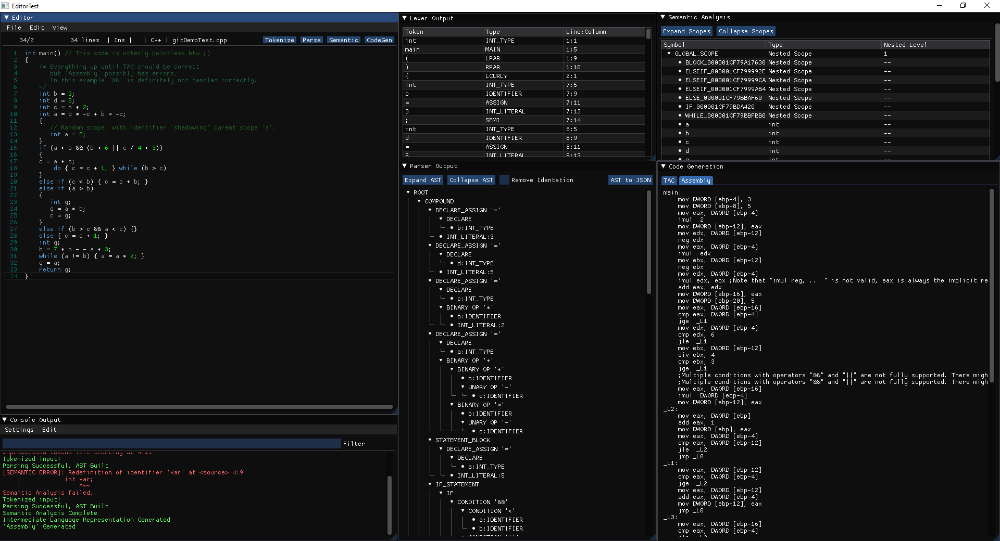

# C--Compiler

C--Compiler is an attempt to make, by hand, a very basic compiler to translate C++ into assembly for educational purposes.
The aim to begin with, is for the compiler to be able to process a relatively small subset of C++, hence 
the name C--. This project has nothing to do with the C-- proramming language despite what the name of this project might suggest. 
 *This project was part of a final year dissertation. [the final_year_proj_june2020](https://github.com/Gast91/C--Compiler/tree/fin_year_proj_june2020) branch reflects the project as it stood on submission*

 

  

## Getting Started

### Prerequisites

- [Dear ImGui](https://github.com/ocornut/imgui) Intermediate Mode GUI.
- [SFML](https://github.com/SFML/SFML) as the rendering backend.
- [SFML-Bindings](https://github.com/eliasdaler/imgui-sfml) Dear ImGui SFML bindings - Can optionally use any other rendering backend *Note sfml bindings do not support imgui docking*.
- [ImGuiColorTextEdit](https://github.com/BalazsJako/ImGuiColorTextEdit) Dear ImGui Text Editor Extension/Widget.
- [ImGuiFileDialog](https://github.com/aiekick/ImGuiFileDialog) Dear ImGui Extension/Widget for file dialogs.
- [magic_enum](https://github.com/Neargye/magic_enum) for stringifying enums.

- [treant-js](https://github.com/fperucic/treant-js) can *optionally* be used to visualize the Abstract Syntax Tree produced by the parser using a web browser (**required** for the dissertation branch).

- C++17

### Current Features

- Lexical Analysis (Mostly complete but some tokens, while they will be tokenized, they wont be recongized leading the parser to throw an error)
- Parsing (declaration, declaration-assignment, assignment, if-elseif-else, while-dowhile, arithmetic-logical expressions, return statements)
- **Partial integration in this branch** Semantic Analysis (Checks for variable being declared or redefined in the current scope, nested scopes, symbols, symbol tables)
- **Not integrated yet in this branch** Intermediate code generation (TAC) for the language constructs mentioned above.
- **Not integrated yet in this branch** Some assembly

### In Progress

- Integration of current modules from [the final_year_proj_june2020](https://github.com/Gast91/C--Compiler/tree/fin_year_proj_june2020) as Dear Imgui windows.

## Authors

* **Dimitrios Kazakos** - *Initial work* - [Gast91](https://github.com/Gast91)

## License

This project is licensed under the MIT License - see the [LICENSE.md](LICENSE.md) file for details
